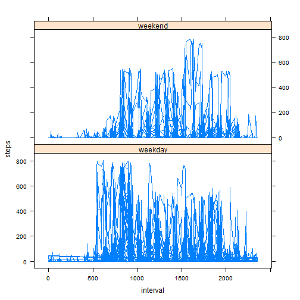

# Reproducible Research: Peer Assessment 1


## Loading and preprocessing the data

This script and the dataset file `"activity.zip"` are located in the GitHub repository and therefore
you should use the folder contains these files as your working directory. If you want this script to work
in another folder, copy the dataset `"activity.zip"` to that folder and change this folder in the following `path`


```r
path <- "F:/UHM/Coursera/Data Science/5_Reproducible Research/CourseProject1" ## this path should be change accordingly to your working directory
setwd(path) ## set working directory
```

* unzip the dataset file


```r
zipFile <- "activity.zip"
unzip(zipFile)
```

* read the csv data


```r
data <- read.csv(file = "activity.csv", sep =",", header = TRUE)
```

```r
Sys.setlocale(category = "LC_TIME", locale = "US") ## set local date, change local if required
data$date <- as.Date(data$date) ## convert to date class type
```

* process data


```r
data.sumbydate <- aggregate(data$steps, by=list(data$date), FUN=sum) ## aggreagate total step each day
names(data.sumbydate) <- c("date", "sum")
```

## What is mean total number of steps taken per day?

* histogram of the total number of steps taken each day


```r
with(data.sumbydate, hist(sum, breaks = 50,
                          main = " Histogram of the total number of steps taken each day",
                          xlab = "Total number of steps taken each day"))
```

 

* mean total number of steps


```r
mean(data.sumbydate$sum, na.rm = TRUE)
```

```
## [1] 10766
```

* median total number of steps


```r
median(data.sumbydate$sum, na.rm = TRUE)
```

```
## [1] 10765
```

## What is the average daily activity pattern?

* a time series plot of the 5-minute interval (x-axis) and the average number of steps taken, averaged across all days (y-axis)


```r
steps.interval.data <- aggregate(data$steps, by=list(data$interval), FUN=mean, na.rm = TRUE) ## aggregate steps by interval, averaging across days
names(steps.interval.data) <- c("interval", "mean")
with(steps.interval.data, plot(interval, mean, type = "l",
                               main = " The number of steps taken per 5-minute interal, averaged across all days",
                               ylab = "averaged step"))
```

 

## Imputing missing values


```r
good <- !is.na(data$steps)
sum(!good) ## report the total number of misisng values in the dataset
```

```
## [1] 2304
```

```r
gooddata <- data[good,]
```


```r
gooddata.sumbydate <- aggregate(gooddata$steps, by=list(gooddata$date), FUN=sum)
names(gooddata.sumbydate) <- c("date", "sum")
```


```r
with(gooddata.sumbydate, hist(sum, breaks = 50,
                              main = " Histogram of the total number of steps taken each day",
                              xlab = "Total number of steps taken each day"))
```

 


```r
mean(gooddata.sumbydate$sum, na.rm = TRUE)
```

```
## [1] 10766
```

```r
median(gooddata.sumbydate$sum, na.rm = TRUE)
```

```
## [1] 10765
```

## Are there differences in activity patterns between weekdays and weekends?

* create a new factor variable named `weekday` contains two values ("weekday" and "weekend")


```r
days <- weekdays(data$date, abbreviate = TRUE) ## get weekdays (character-type like Mon for Monday)
data$days <- days ## add new column to dataset
func <- function(x){ 
        if (x == "Sat" | x == "Sun") ("weekend") ## weekend?
        else ("weekday") ## weekday?
}
weekday <- lapply(data$days, func)
data$weekday <- paste(weekday)
data <- transform(data, weekday = factor(weekday)) ## transform weekday variable into factor variable
```

* a time series plot  of the 5-minute interval (x-axis) and the average number of steps taken, averaged across all weekday days or weekend days (y-axis)


```r
#install.packages("lattice")  ## install this package if required
library(lattice)
xyplot(steps ~ interval | weekday, data = data, type = "l", layout = c(1,2))
```

 
